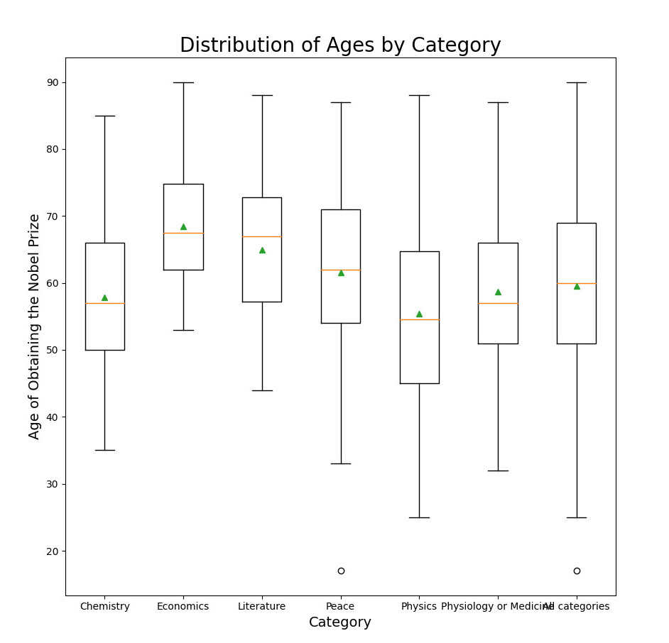

# Nobel Laureates

Project from Introduction to Data Science course excercising usage of JSON format, numpy, pandas and matplotlib modules, file handling and data preprocessing techniques.

## Installation

Os module is a python built-in module. No installation is required.

Numpy, pandas and matplotlib modules have to be installed using pip:

```
$ pip3 install numpy
```

```
$ pip3 install pandas
```

```
$ pip3 install matplotlib
```

## Requirements

Code was developed and tested using: 

Ubuntu 18.04.6 LTS 

Python 3.6.9

## Usage

The program arranges the dataset of Nobel Laureates provided in JSON format and generates a pie chart, bar chart and a box plot illustrating the data.




## Support

If you face any problem let me know by Issue.

